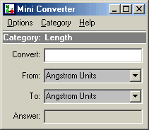

## MiniConverter 1\.0\.4

### Description

Mini Converter does over 3,000 differant conversions. The program has been designed to be small and un-intrusive and despite it's simple interface is quite powerful! [Customise visible categories.]-[Always on top ability]-[Able to Add/Remove Categories. (through Excel™)]-[Able to Add/Remove Units. (through Excel™)]-[Set Precision.]-[Set 3 hot keys]

Requires: Windows 95™, Microsoft Excel™
 
### More Info
 

             |
---                |---
**Submitted On**   |2002-12-30 03:24:02
**By**             |[Daniel Cassar](https://github.com/Planet-Source-Code/PSCIndex/blob/master/ByAuthor/daniel-cassar.md)
**Level**          |Advanced
**User Rating**    |5.0 (15 globes from 3 users)
**Compatibility**  |VB 6\.0
**Category**       |[Complete Applications](https://github.com/Planet-Source-Code/PSCIndex/blob/master/ByCategory/complete-applications__1-27.md)
**World**          |[Visual Basic](https://github.com/Planet-Source-Code/PSCIndex/blob/master/ByWorld/visual-basic.md)
**Archive File**   |[MiniConver15204012302002\.zip](https://github.com/Planet-Source-Code/daniel-cassar-miniconverter-1-0-4__1-41960/archive/master.zip)

